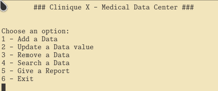
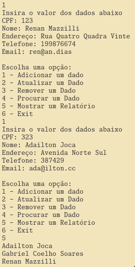
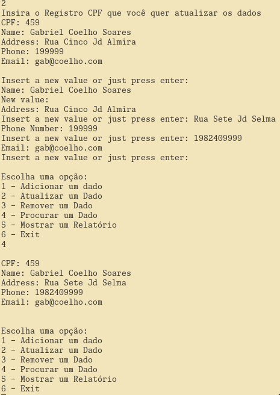

# Visão computacional

## Propósito e Problema a Resolver

Desenvolver uma plataforma de banco de dados centralizada e segura para armazenar e gerenciar informações de médicos.  O sistema permitirá que instituições de saúde, clínicas e hospitais registrem dados essenciais de seus profissionais, como CPF, nome, registro de admissão, endereço, telefone e e-mail de maneira simples, confiável e em conformidade com as regulamentações de privacidade.

## Público-Alvo

- Hospitais e Clínicas: Departamentos de RH e administrativos que precisam gerenciar as informações dos médicos de forma centralizada.
- Organizações de Saúde: Instituições que buscam uma solução padronizada para armazenar e consultar dados de profissionais de saúde.

## Valor Agregado

Esse banco de dados oferece:

- Segurança e Conformidade: Proteção dos dados conforme exigências de privacidade e regulamentação.
- Escalabilidade: Sistema preparado para crescer com a necessidade da instituição.

# Requisitos Funcionais

| ID   | Prioridade | Descrição                     | Detalhamento                                                                                      | Estimativa |
|------|------------|-------------------------------|---------------------------------------------------------------------------------------------------|------------|
| RF01 | Alta       | Cadastro de Médicos           | Permitir o cadastro de médicos com CPF, nome, data de admissão, endereço, telefone e e-mail.      | 3 semanas  |
| RF02 | Alta       | Consulta de Médicos           | Permitir busca por médicos utilizando filtros como nome, CPF e data de admissão.                  | 2 semanas  |
| RF03 | Média      | Atualização de Dados          | Permitir que os dados de médicos cadastrados sejam atualizados, como endereço, telefone e e-mail. | 2 semanas  |
| RF04 | Média      | Remoção de Registros          | Permitir exclusão de registros de médicos.                                                        | 1 semana   |
| RF05 | Alta       | Relatórios                    | Gerar relatórios com informações básicas dos médicos cadastrados e exportação em formato TXT.     | 2 semanas  |

# Requisitos Não Funcionais

| ID   | Prioridade | Descrição                     | Detalhamento                                                                                                                                                             | Estimativa |
|------|------------|-------------------------------|-------------------------------------------------------------------------------------------------------------------------------------------------------------------------|------------|
| RNF02| Alta       | Escalabilidade                | Projetar o sistema para suportar aumento de registros e atender a instituições de grande porte.                                                                         | 2 semanas  |
| RNF04| Média      | Desempenho                    | Garantir que consultas a registros sejam realizadas em menos de 2 segundos, mesmo com alto volume de dados.                                                              | 2 semanas  |
| RNF07| Baixa      | Manutenibilidade              | Código modular e documentado, permitindo fácil atualização e manutenção técnica.                                                                                         | 3 semanas  |

# Descrição dos Fluxos de Eventos

## Caso de Uso 1: Cadastro de Médicos

**Atores:** Administrador, Usuário Autorizado.  
**Descrição:** Permitir o registro de médicos com suas informações essenciais.

### Fluxo Principal

1. O ator acessa o sistema e seleciona a opção "Cadastrar Médico".
2. O sistema exibe um formulário com os seguintes campos: CPF, nome, data de admissão, endereço, telefone e e-mail.
3. O ator preenche os campos obrigatórios.
4. O sistema valida as informações inseridas (e.g., formato do CPF, campos obrigatórios).
5. Se válido, o registro é salvo no banco de dados.
6. O sistema confirma o sucesso do cadastro ao ator.

### Fluxo Alternativo

- Caso os dados sejam inválidos ou incompletos:
  1. O sistema exibe mensagens de erro específicas.
  2. O ator pode corrigir os campos.

---

## Caso de Uso 2: Consulta de Médicos

**Atores:** Administrador, Usuário Autorizado.  
**Descrição:** Buscar informações de médicos cadastrados com filtros.

### Fluxo Principal

1. O ator acessa o sistema e seleciona a opção "Consultar Médico".
2. O sistema exibe opções de filtros: Nome, CPF, Data de Admissão.
3. O ator insere um ou mais filtros.
4. O sistema realiza a consulta no banco de dados.
5. O sistema exibe os resultados correspondentes na interface.

### Fluxo Alternativo

- Se nenhum registro corresponder aos filtros:
  - O sistema exibe uma mensagem informando que "Nenhum registro foi encontrado".

---

## Caso de Uso 3: Atualização de Dados

**Atores:** Administrador.  
**Descrição:** Permitir a edição de dados de médicos já cadastrados.

### Fluxo Principal

1. O ator acessa o sistema e busca o médico desejado através da funcionalidade de consulta.
2. Após localizar o médico, o ator seleciona a opção "Editar".
3. O sistema exibe os dados existentes em um formulário editável.
4. O ator altera os campos desejados.
5. O sistema valida as alterações.
6. Se válido, o sistema salva as mudanças no banco de dados e exibe uma mensagem de sucesso.

### Fluxo Alternativo

- Caso a validação dos dados falhe:
  - O sistema exibe uma mensagem de erro, permitindo que o ator corrija as informações.

---

## Caso de Uso 4: Remoção de Registros

**Atores:** Administrador.  
**Descrição:** Permitir a exclusão de registros de médicos.

### Fluxo Principal

1. O ator acessa o sistema e realiza uma consulta para localizar o médico.
2. Após localizar o médico, o ator seleciona a opção "Excluir".
3. O sistema solicita confirmação antes de excluir o registro.
4. O ator confirma a exclusão.
5. O sistema remove o registro do banco de dados e exibe uma mensagem de sucesso.

### Fluxo Alternativo

- Se o ator cancelar a exclusão:
  - O sistema retorna à tela de consulta.

---

## Caso de Uso 5: Geração de Relatórios

**Atores:** Administrador.  
**Descrição:** Criar relatórios contendo informações básicas dos médicos cadastrados.

### Fluxo Principal

1. O ator acessa o sistema e seleciona a opção "Gerar Relatório".
2. O sistema exibe as opções de conteúdo do relatório (e.g., todos os médicos ou filtro por data de admissão).
3. O ator seleciona os critérios desejados e confirma.
4. O sistema gera um arquivo no formato TXT contendo as informações solicitadas.
5. O arquivo é disponibilizado para download ou visualização.

### Fluxo Alternativo

- Caso não haja dados para gerar o relatório:
  - O sistema exibe uma mensagem informando que "Nenhum dado foi encontrado para os critérios selecionados".

# Diagrama de casos de uso

# Diagrama de atividades

# Modelagem de classes

# Guia do usuário

Ao executar o programa, o usuário verá uma tela simples de menu para interação via linha de comando:

Cada item realiza o que sua descrição diz, a saber:

1. "Add a Data" -> *adiciona um novo registro de médico, solicitando CPF, Nome, Endereço, Telefone e E-mail*
2. "Update a Data Value" -> Altera/Atualiza um registro já existente a partir de um CPF cadastrado.
3. "Remove a Data" -> Remove um cadastro.
4. "Search a Data" -> Procura por um cadastro a partir do CPF.
5. "Give a Report" -> Imprime o relatório na tela e num arquivo com o nome de cada médico cadastrado.
6. "Exit" -> Termina o programa.

**Abaixo estarão algumas imagens mostrando um breve fluxo de uso da aplicação**

# Tecnologias utilizadas

- Git
- Github
- C
- Neovim

# Problemas e soluções

Durante o desenvolvimento não foram encontrados muitos impedimentos que causassem precupações, apenas um pequeno atraso na funcionalidade de consistência e permanência de dados. O sistema cumpre com exatidão o que foi proposto pela equipe de desenvolvimento em cada sprint. Todas as funcionalidades pensadas são executadas perfeitamente no ambiente ao qual o sistema foi determinado.

# Conclusão

O desenvolvimento da plataforma de banco de dados centralizada para o gerenciamento de informações médicas atingiu todos os objetivos propostos de maneira eficaz. A solução apresenta uma interface intuitiva e funcionalidades robustas que permitem o cadastro, consulta, atualização e remoção de dados, além de gerar relatórios de forma ágil e confiável.

Os fluxos de uso foram planejados para minimizar erros e garantir uma experiência satisfatória ao usuário, enquanto a base técnica foi estruturada para possibilitar futuras expansões e adaptações às demandas do mercado.

Com a aplicação das tecnologias propostas e a superação dos desafios encontrados, o sistema demonstra ser uma ferramenta valiosa para centralizar e gerenciar dados de profissionais da área da saúde, promovendo agilidade e confiabilidade no acesso às informações. Este projeto estabelece uma base sólida para futuras melhorias e expansão, contribuindo significativamente para a gestão eficiente no setor médico.